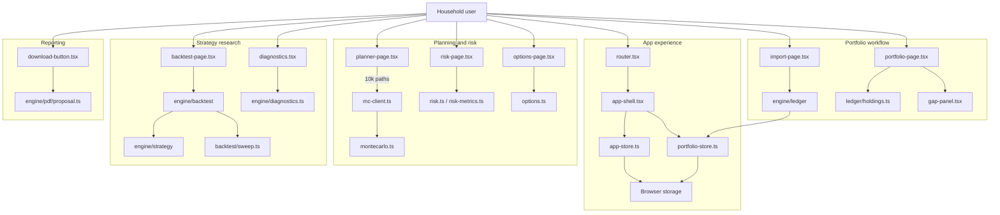

# NORDLYS

Private wealth planning that runs in the browser.

I wanted something I could sit down with and actually use on a household: goals, a portfolio built from transactions, risk on that same book, and a backtest I could read. Not a dashboard that pretends one forecast is the future.

I built it in Grok Build Mode. I directed the product — what it should do, what it must not do, and when a screen was good enough to show someone. Grok wrote most of the implementation. That collaboration is visible in this repo. I am fine with that.

Nothing leaves the device. There are no accounts. Demo, My Data, and Privacy are just modes.

## What it does

- **Planner** — household, goals, risk answers, and a 10,000-path Monte Carlo. The fan is a spread of outcomes, not a single line.
- **Portfolio** — holdings and allocation from a ledger, not a pasted snapshot.
- **Import** — drop a Nordnet transactions export. Mapping is remembered. The file is not uploaded.
- **Risk** — drawdown, tails, correlation, stress, on the same book.
- **Backtest** — a small strategy language. `close` is this bar, `close[1]` is the previous close. Signals use that close; orders fill next session. The parameter sweep shows in-sample next to out-of-sample so overfitting is visible.
- **Diagnostics** — the engine checks itself: fuzz on the parsers, and timings for the 10k plan, the proposal PDF, and a 100,000-row import / file parse.
- **Show this** — a short walkthrough of those screens if you are presenting it.

## How it is put together

One user. Four jobs. No server.

The shell reads and writes two stores. The household and the plan live in `app-store.ts`. The ledger lives in `portfolio-store.ts`. Both persist in the browser.



The Monte Carlo can run on the main thread or in a worker. Sweeps use a worker so the page stays usable. The PDF is built from the plan that already ran — it should not simulate again just to write a file.

## Choices I would stand behind

**Stay in the browser.** Net worth does not belong on a server I stood up for a portfolio piece.

**Do not look ahead.** Negative offsets like `close[-1]` are a parse error. Looking back in time is the only direction that is allowed.

**Show the out-of-sample number.** A sweep that only prints the best in-sample Sharpe is a ranking of luck. In-sample is the first ~70% of the calendar; out-of-sample is the rest.

**Time the real work.** The PDF should reuse the 10k result it is documenting. Re-running the simulation inside the PDF clock would make the number look better than the product.

**Do not weaken the tests to hit a budget.** Import and parse of 100k rows both have to stay under two seconds for real.

## Run it

```bash
npm install
npm run dev
```

Then:

```bash
npm run typecheck
npm run build
```

Open **Show this** from the planner or the sidebar if you want the six-stop walkthrough.

## What I would change

Diagnostics should not freeze the UI the first time someone opens that page in a demo. Imported price history should win over demo series once a file is there. I would not put personal data on a server until there was real auth — which this app deliberately does not have.
